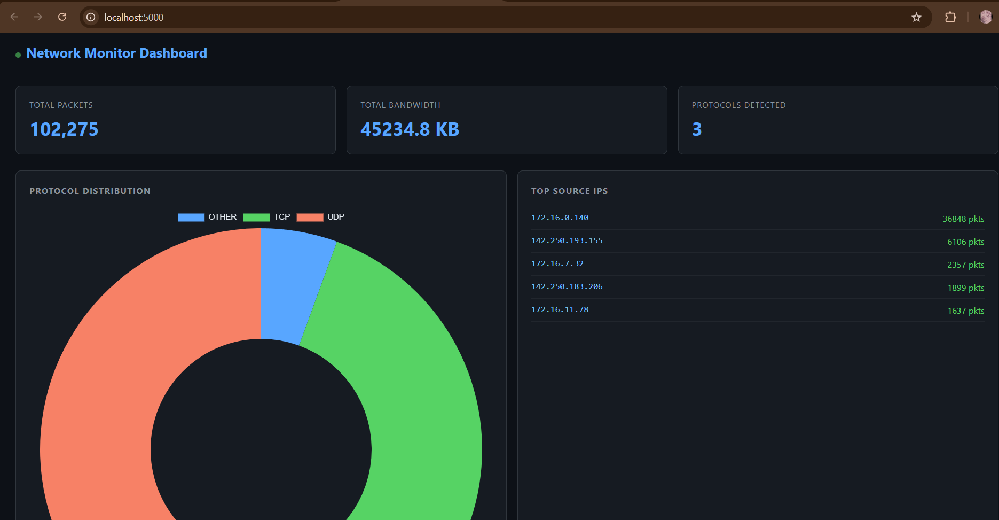
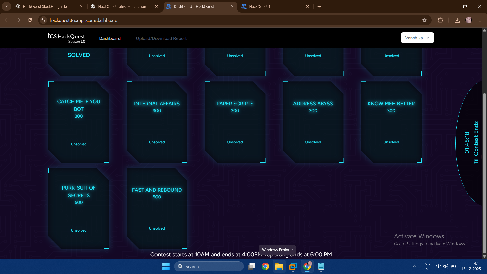

# Network Monitor Dashboard

> Real-time network traffic monitoring tool that captures packet metadata,
> parses protocol data, and streams live statistics to a web dashboard via WebSockets.


---

## What This Project Does

This tool sits on a live network interface, captures every packet passing through,
parses the protocol layer (TCP/UDP/ICMP), stores metadata in a local database,
and streams real-time statistics to a browser dashboard using WebSockets.

No manual refresh. No static data. Live network intelligence — exactly what
a System Integrator working with networking infrastructure needs to build.

---

## System Integration Architecture
```
Network Interface (Live Traffic)
        ↓
Scapy Packet Capture (Layer 3/4)
        ↓
Protocol Parser (TCP / UDP / ICMP)
        ↓
SQLite Database (Packet Storage)
        ↓
Flask + WebSocket Server
        ↓
Real-time Dashboard (Chart.js)
        ↓
Live Statistics → Browser
```

---

## Tech Stack

| Layer | Technology | Purpose |
|---|---|---|
| Packet Capture | Scapy | Raw socket packet sniffing |
| Protocol Parsing | Python | TCP/UDP/ICMP layer parsing |
| Database | SQLite | Packet metadata storage |
| Backend | Flask + Flask-SocketIO | REST API + WebSocket server |
| Frontend | HTML/CSS/JavaScript | Dashboard UI |
| Visualization | Chart.js | Real-time charts |

---

## Features

- 🔴 **Live packet capture** — captures real network traffic in real time
- 📊 **Protocol distribution** — doughnut chart showing TCP/UDP/ICMP breakdown
- 🌐 **Top source IPs** — identifies highest traffic sources
- 📈 **Bandwidth tracking** — total bytes transferred
- ⚡ **WebSocket streaming** — dashboard updates every 2 seconds automatically
- 🗄️ **Persistent storage** — all packets stored in SQLite for analysis

---

## Screenshots

### Live Dashboard


### Packet Capture Running in Terminal


---

## Project Structure
```
network-monitor-dashboard/
├── backend/
│   ├── capture.py          # Scapy packet capture engine
│   ├── parser.py           # Protocol layer parser (TCP/UDP/ICMP)
│   ├── db.py               # SQLite ingestion and stats aggregation
│   └── app.py              # Flask + WebSocket server
├── frontend/
│   ├── index.html          # Dashboard UI
│   └── dashboard.js        # Real-time Chart.js visualization
├── screenshots/
│   ├── dashboard.png
│   └── terminal.png
├── requirements.txt
├── .env.example
└── README.md
```

---

## Setup & Installation

### Prerequisites
- Python 3.8+
- [Npcap](https://npcap.com) installed (Windows only — required for Scapy)
- Run terminal as **Administrator** (required for raw socket capture)

### Install Dependencies
```bash
git clone https://github.com/Vanshika110/network-monitor-dashboard
cd network-monitor-dashboard
pip install -r requirements.txt
```

### Run the Project

**Terminal 1 — Start packet capture (run as Administrator):**
```bash
python backend/capture.py
```

**Terminal 2 — Start dashboard server:**
```bash
python backend/app.py
```

**Open browser:**
```
http://localhost:5000
```

---

## API Endpoints

| Method | Route | Description |
|---|---|---|
| GET | `/` | Dashboard UI |
| GET | `/api/stats` | JSON stats snapshot |
| WS | `socket.io` | Live stats stream |

---

## Sample API Response
```json
{
  "total_packets": 1284,
  "total_bytes": 983040,
  "protocols": {
    "TCP": 1100,
    "UDP": 150,
    "ICMP": 34
  },
  "top_ips": [
    ["192.168.1.1", 450],
    ["8.8.8.8", 230],
    ["172.16.0.1", 180]
  ]
}
```

---

## System Integration Relevance

This project demonstrates core **Networking + Data Engineering + Security** skills:

| Skill | How Demonstrated |
|---|---|
| **Network protocols** | TCP/IP/UDP/ICMP parsing at Layer 3/4 |
| **Real-time data pipeline** | Capture → Parse → Store → Stream → Visualize |
| **WebSocket integration** | Bidirectional live data between Python and JS |
| **Security monitoring** | IP traffic analysis, protocol anomaly detection |
| **System integration** | Multiple components wired into one working system |

---

## Requirements
```
flask==3.0.0
flask-socketio==5.3.6
scapy==2.5.0
python-dotenv==1.0.0
eventlet==0.35.1
```

---

## Environment Variables
```bash
# .env
SECRET_KEY=your-secret-key-here
INTERFACE=eth0
```

---

